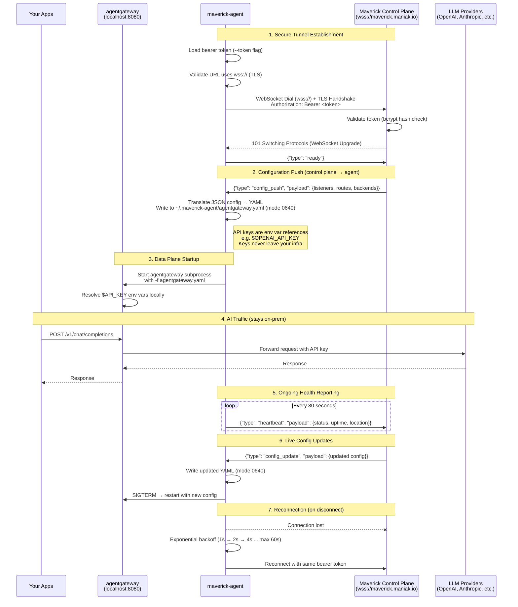

# maverick-agent

On-prem data plane agent for the [Maverick AI Gateway Platform](https://maverick.maniak.io).

Run your AI gateway on **your infrastructure** — Maverick manages the config, you own the data plane.

## Quick Start

```bash
# Install
curl -sSL https://raw.githubusercontent.com/ProfessorSeb/maverick-agent/main/install.sh | bash

# Connect to Maverick (get your token from the dashboard)
maverick-agent --token mav_agent_xxx
```

## What it does

`maverick-agent` connects your on-prem infrastructure to the Maverick control plane:

1. **Connects outbound** to Maverick via secure WebSocket tunnel (wss://)
2. **Receives configuration** (listeners, routes, backends) from your Maverick dashboard
3. **Downloads and runs** [agentgateway](https://github.com/agentgateway/agentgateway) as a managed subprocess
4. **Proxies AI traffic** locally — your apps talk to `localhost:8080` instead of calling LLM providers directly
5. **Reports health** back to the dashboard (status, location, metrics)

```
Your Apps → localhost:8080 → agentgateway → OpenAI/Anthropic/etc.
                                    ↕
                           Maverick Control Plane
                        (config, monitoring, policies)
```

## Install

### One-liner (Linux/macOS)

```bash
curl -sSL https://raw.githubusercontent.com/ProfessorSeb/maverick-agent/main/install.sh | bash
```

### Docker

```bash
docker run -d \
  --name maverick-agent \
  ghcr.io/professorseb/maverick-agent:latest \
  --token mav_agent_xxx
```

### Manual Download

Download from [GitHub Releases](https://github.com/ProfessorSeb/maverick-agent/releases).

### Build from source

```bash
git clone https://github.com/ProfessorSeb/maverick-agent.git
cd maverick-agent
go build -o maverick-agent .
```

## Usage

```bash
maverick-agent \
  --token mav_agent_xxx \                          # Required: registration token from dashboard
  --control-plane wss://api.maverick.maniak.io/tunnel  # Default control plane URL
  --config-dir ~/.maverick-agent/                  # Config and binary storage
  --version                                        # Print version and exit
```

## How it works

1. Create an **Agentgateway Waypoint** in the [Maverick Dashboard](https://maverick.maniak.io/dashboard/agentgateways)
2. Copy the one-time registration token
3. Run `maverick-agent --token <token>` on your server
4. The agent connects to Maverick, receives your listener/route/backend config
5. agentgateway starts locally and begins proxying traffic
6. Dashboard shows the agent as **connected** with location and health metrics

### Security

- **TLS encrypted** tunnel (wss://) between agent and control plane
- **Outbound only** — no inbound firewall rules needed
- **Token auth** — bcrypt-hashed, rotatable from dashboard
- **API keys stay on-prem** — LLM provider keys never leave your infrastructure
- **Auto-reconnect** with exponential backoff on disconnect

#### Secure Connection Flow

The following diagram shows how the data plane agent establishes and maintains a secure connection to the Maverick control plane:



#### Security Architecture Summary

```
┌─────────────────────────────────────────────────────────┐
│                  YOUR INFRASTRUCTURE                     │
│                                                          │
│  ┌──────────┐    ┌──────────────┐    ┌───────────────┐  │
│  │ Your Apps │───▶│agentgateway  │───▶│ LLM Providers │  │
│  │          │◀───│ :8080        │◀───│ (OpenAI, etc.)│  │
│  └──────────┘    └──────────────┘    └───────────────┘  │
│                         ▲                                │
│                         │ managed by                     │
│                  ┌──────┴───────┐                        │
│                  │maverick-agent│                        │
│                  └──────┬───────┘                        │
│                         │                                │
│    API keys ($ENV)      │ outbound wss:// only           │
│    stay here ───────────┤ Bearer token auth              │
│                         │ TLS encrypted                  │
├─────────────────────────┼───────────────────────────────┤
│          FIREWALL       │ no inbound rules needed        │
├─────────────────────────┼───────────────────────────────┤
│                         ▼                                │
│              ┌─────────────────────┐                     │
│              │ Maverick Control    │                     │
│              │ Plane (SaaS)       │                     │
│              │ - config management │                     │
│              │ - token validation  │                     │
│              │ - health dashboard  │                     │
│              └─────────────────────┘                     │
└─────────────────────────────────────────────────────────┘
```

| Layer | Mechanism | Details |
|-------|-----------|---------|
| **Transport** | TLS 1.2+ (wss://) | Go default TLS with system CA validation |
| **Authentication** | Bearer token | One-time registration token, bcrypt-hashed server-side |
| **Token management** | Rotatable | Rotate/revoke from Maverick dashboard |
| **API key isolation** | Env var references | Control plane sends `$OPENAI_API_KEY`, never the actual key |
| **Config file perms** | `0640` | Owner read/write, group read, others none |
| **Config dir perms** | `0750` | Owner rwx, group rx, others none |
| **Connection model** | Outbound only | No inbound firewall rules or open ports required |
| **Reconnection** | Exponential backoff | 1s → 2s → 4s → ... → 60s max |
| **Process isolation** | Managed subprocess | agentgateway runs as a child process with SIGTERM/SIGKILL lifecycle |

## License

Apache 2.0
